# 📖 X-Ray 插件 - KOReader

在电脑端利用 AI 生成 X-Ray 数据，并在 KOReader 上实现 Amazon Kindle X-Ray 阅读体验，为任何 EPUB 书籍提供角色、地点、主题和时间线分析。

> Fork 自 [koreader-xray-plugin](https://github.com/0zd3m1r/koreader-xray-plugin)，进行了架构重写：原版仅发送书名给 AI（导致幻觉和剧透），本 Fork **发送实际书籍文本**，确保分析准确。


---

## 截图

### PC 端 GUI

#### 配置标签页（Configuration）

提供商选择（OpenAI 兼容 / Claude / Groq / Gemini / DeepSeek）、在线获取模型列表、API 密钥填写、Calibre 书库路径、温度设置；底部**重试/回退链**可配置多模型串联，失败时自动切换到下一个。

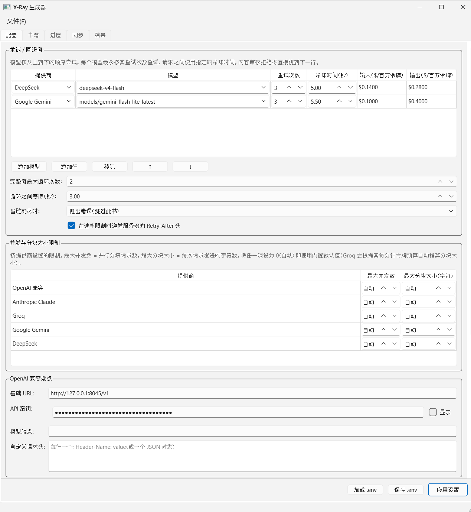

#### 书库标签页（Books）

显示从 Calibre 扫描到的所有 EPUB，每行标注 X-Ray 分析进度（未开始 / 部分 N% / 完成）及 WebDAV 同步状态（已同步 / 未上传 / 有差异 / 仅服务器上）。

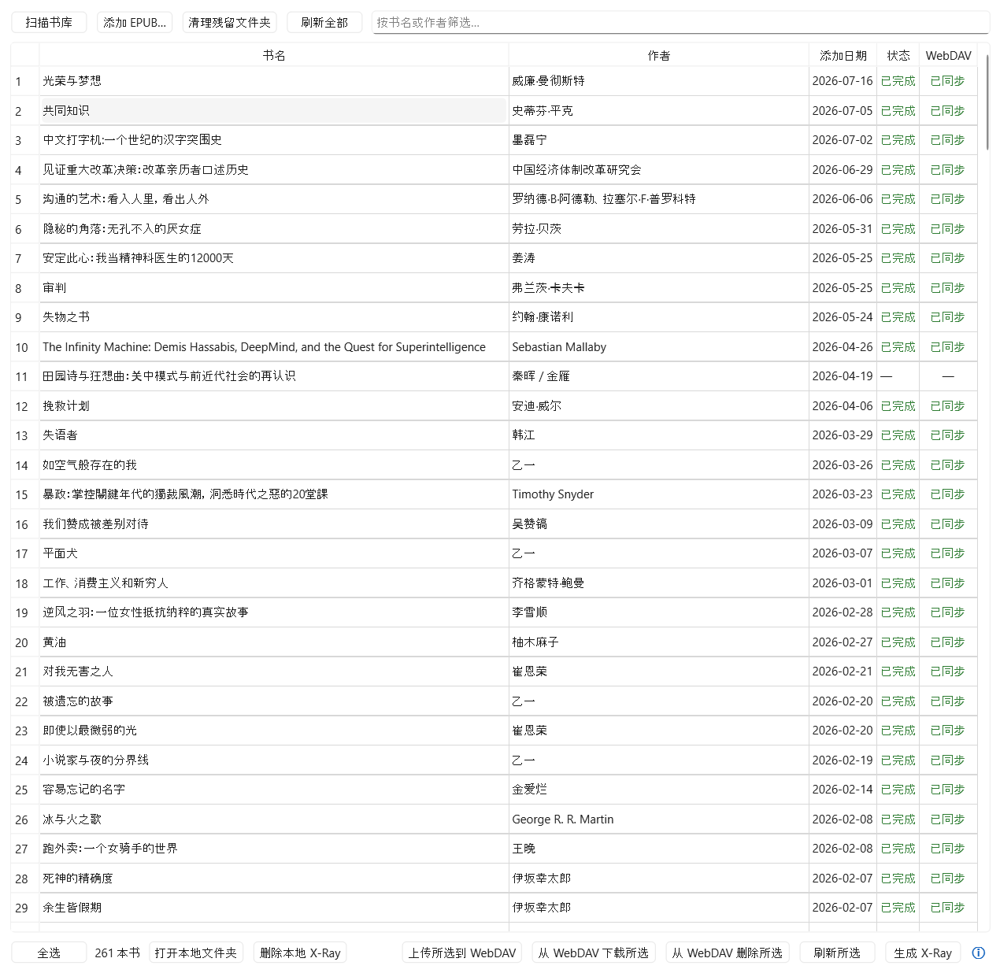

#### 进度标签页（Progress）

批量分析时显示整体进度条、当前分块计数及实时角色/地点/事件统计；流式日志控制台输出每个分块的 AI 调用详情。

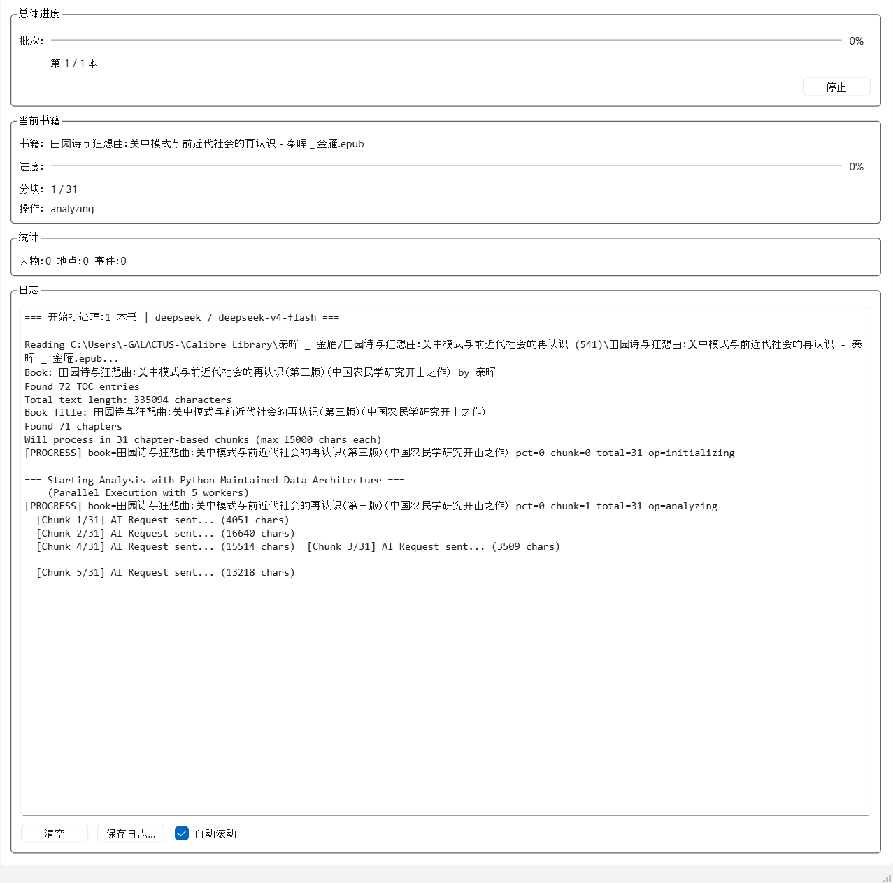

#### 令牌用量与费用摘要

批处理完成后自动弹出，显示各模型的输入/输出令牌数、字符数及预估费用（价格实时从 [LiteLLM 社区目录](https://github.com/BerriAI/litellm/blob/main/model_prices_and_context_window.json) 获取）。

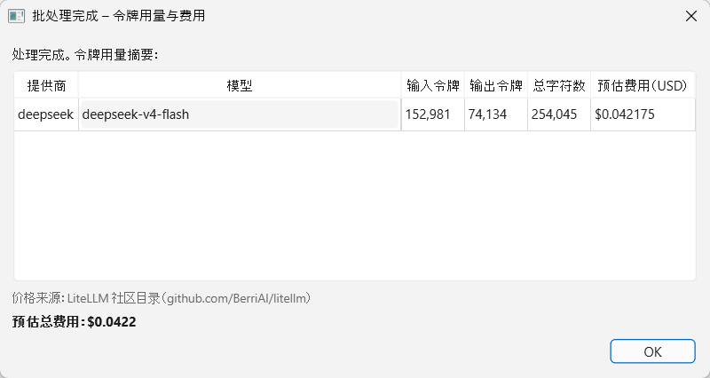

#### 同步标签页（Sync）

配置 WebDAV 服务器地址与凭据，一键上传/下载；或输入设备 IP 通过 Wi-Fi 直接推送 `xray_data.json` 到阅读器。

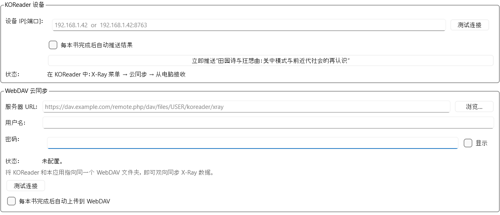

---

### KOReader 设备端

#### X-Ray 主菜单

**菜单 → X-Ray** 进入，列出角色、章节角色、时间线、地点、主题等所有条目数（仅统计已读部分）。

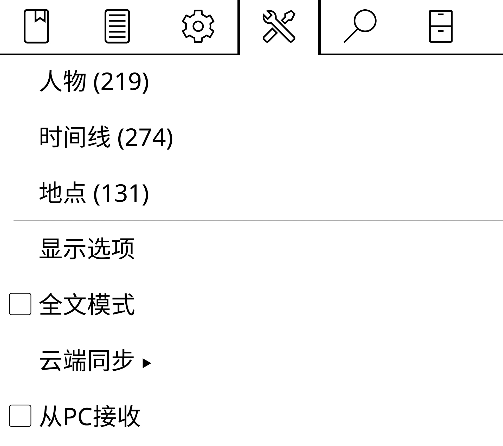

#### 角色列表

按重要性排序，只显示在当前阅读进度内出现过的角色，顶部有搜索入口。

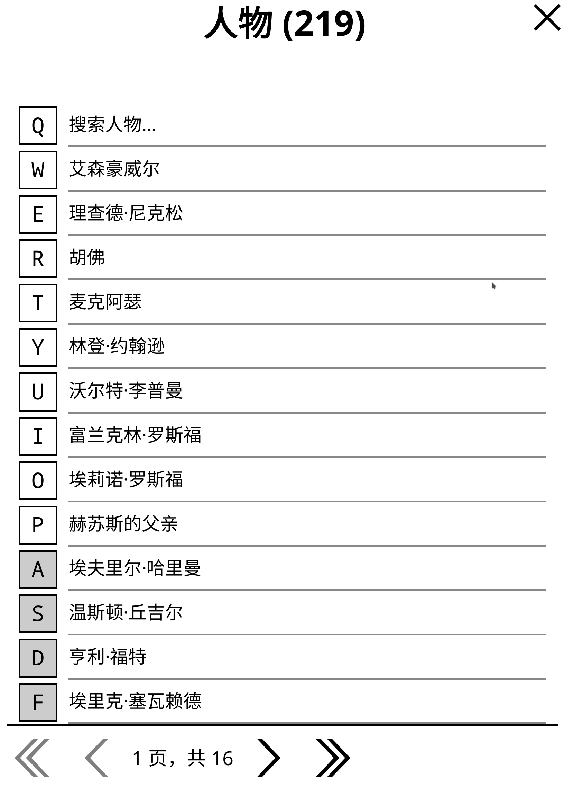

#### 地点列表

书中出现的地点及其描述，仅显示已读范围内的地点。

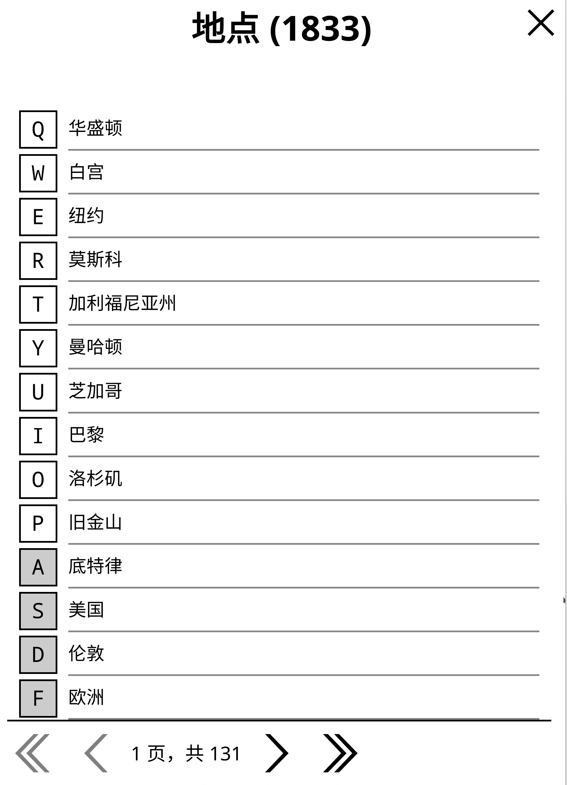

#### 时间线

全书已读事件按发生顺序排列，格式为「人物 · 事件」，点击可跳转到原文锚点。

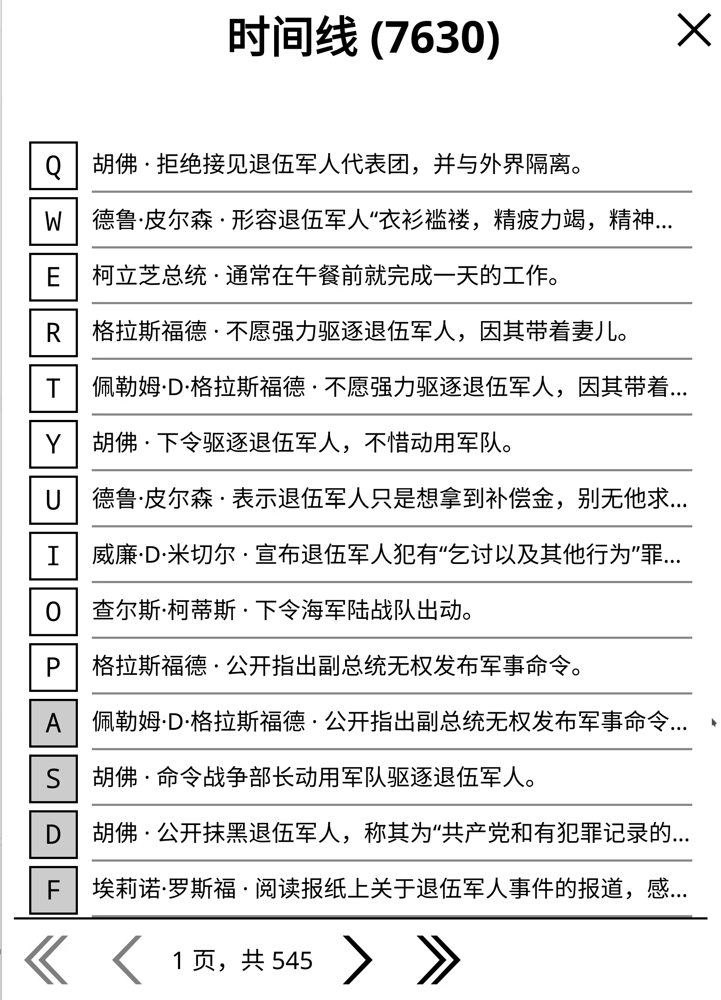

#### 长按文字 → X-Ray 上下文菜单（角色）

长按书中文字后，若匹配到已知角色，菜单中出现「X-Ray」选项。

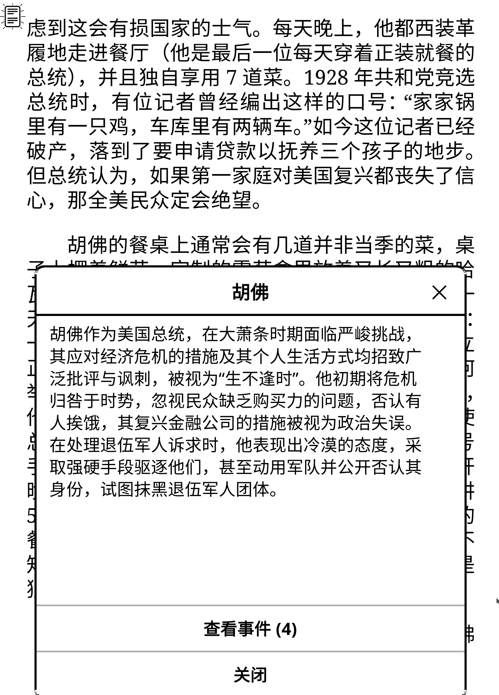

#### 长按文字 → X-Ray 上下文菜单（地点）

长按书中文字后，若匹配到已知地点，菜单中出现「X-Ray」选项。

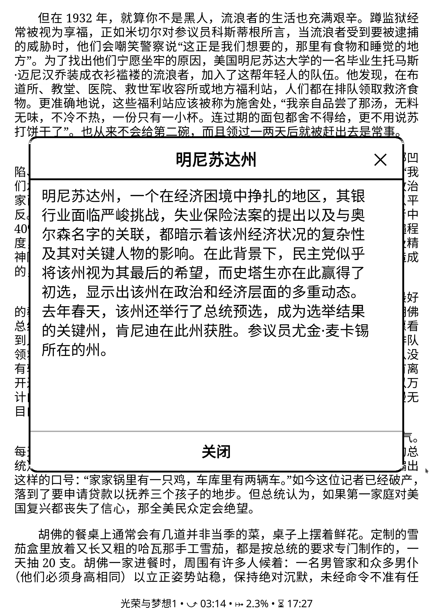

---

## 快速开始

### 1. 安装插件

从 [Releases](https://github.com/Cusanity/xray.koplugin/releases/latest) 下载 `xray.koplugin-v*.zip`，解压到 `/koreader/plugins/`，解压后结构如下：

```
/koreader/plugins/
└── xray.koplugin/
    ├── _meta.lua
    ├── main.lua
    ├── cachemanager.lua
    ├── chapteranalyzer.lua
    ├── characternotes.lua
    ├── localization_xray.lua
    ├── sync.lua
    ├── xray_receiver.lua
    ├── languages/
    │   ├── en.po
    │   ├── zh.po
    │   └── zh_TW.po
    └── LICENSE
```

重启 KOReader。

### 2. 在电脑上生成 X-Ray 数据

从源码运行 GUI，分析 EPUB 后通过 [Wi-Fi 推送](#从pc接收) 或 [WebDAV](#webdav-同步) 传到阅读器。

### 3. 在阅读器上使用

- **菜单 → X-Ray** — 查看角色 / 地点 / 主题 / 时间线（只显示已读内容，零剧透）
- **长按文字 → X-Ray** — 即时查看该角色 / 地点信息

---

## 电脑端生成器（GUI）

在电脑上预生成整本书的 X-Ray 数据（含事件精确定位 `xref`、原文锚点 `anchor`、时间线序号等）。

### 安装

```bash
git clone https://github.com/Cusanity/xray.koplugin.git
cd xray.koplugin
python -m venv .venv
# Windows Git Bash:
source .venv/Scripts/activate
pip install -r requirements.txt
python generator_gui.py
```

Linux/macOS 激活虚拟环境：

```bash
source .venv/bin/activate
```

Windows PowerShell 激活虚拟环境：

```powershell
.\.venv\Scripts\Activate.ps1
```

### 配置

首次运行后，在 **Configuration** 标签页填写 API 密钥和 Calibre 书库路径，点「Save .env」保存（也可提前复制 `.env.example` 为 `.env` 手动填入）：

```env
XRAY_API_BASE=http://localhost:8080/v1
XRAY_API_KEY=your-api-key
XRAY_MODEL=gemini-2.5-flash-lite
CALIBRE_LIBRARY=/path/to/your/Calibre Library
```

> 将 `.env` 放在 `xray.koplugin/` 根目录，API 密钥即可持久化。

### 标签页说明

| 标签页 | 功能 |
|--------|------|
| **Configuration** | 选择提供商（OpenAI 兼容 / Claude / Groq / Gemini / DeepSeek）、在线获取模型列表、填写 API 密钥、设置 Calibre 路径与温度，一键读写 `.env`；通过**重试/回退链**配置多模型串联（失败时自动切换），「生成 X-Ray」按钮旁有 **ⓘ** 图标，悬停即显示当前模型链摘要 |
| **Books** | 从 Calibre 书库扫描书籍（支持自动检测书库位置），支持筛选、多选、手动添加 EPUB；**刷新全部** / **刷新所选** 更新 WebDAV 同步状态；**从 WebDAV 删除所选** 一键删除远程文件夹；清理残留文件夹；开始 / 停止分析；每本书显示 X-Ray 进度（未开始 / 部分 % / 完成）及 WebDAV 同步状态 |
| **Progress** | 批量进度条、分块计数、实时角色 / 地点 / 事件统计、流式日志控制台；批处理完成后自动弹出**令牌用量与费用摘要**（价格实时从 [LiteLLM 社区目录](https://github.com/BerriAI/litellm/blob/main/model_prices_and_context_window.json) 获取） |
| **Sync** | Wi-Fi 推送到设备（从PC接收）或上传 / 下载 / 删除 WebDAV 服务器上的 X-Ray 数据 |
| **Results** | 以树状结构浏览某本书的角色、地点、时间线、主题与摘要 |

> ℹ️ 「停止」会在完成当前书籍后再停止（分块并行执行，不能中途安全取消）。

---

## 传输到阅读器

生成完 `xray_data.json` 后，任选一种方式传到阅读器：

### 从PC接收（Wi-Fi 直推）

无需数据线或云盘，阅读器与电脑在同一 Wi-Fi 下即可：

1. **阅读器**：**菜单 → X-Ray → 从PC接收**，记下显示的设备 IP（默认端口 8763）。
2. **GUI**：在 **Sync** 标签页填入设备 IP，点「立即推送」或勾选生成后自动推送。

### WebDAV 同步

通过 **菜单 → X-Ray → 云端同步** 上传/下载，实现多设备共享。远端目录结构：

```
<WebDAV 根目录>/
└── 书籍.epub.sdr/
    └── xray_analysis/
        └── xray_data.json
```

在 **Sync** 标签页配置 WebDAV 地址与凭据，一键上传；阅读器上点「下载」同步。Books 标签页提供**上传所选 / 下载所选 / 从 WebDAV 删除所选**快捷按钮，以及每行的 WebDAV 同步状态列（已同步 / 未上传 / 有差异 / 仅服务器上），可单独刷新所选书籍状态。

---

## 项目结构

```
xray.koplugin/
├── main.lua              # 插件 UI（菜单、X-Ray 查看器、文本选中处理）
├── cachemanager.lua      # 渐进式 JSON 缓存管理
├── chapteranalyzer.lua   # 设备端 EPUB 文本提取
├── characternotes.lua    # 角色笔记
├── sync.lua              # WebDAV 上传/下载
├── xray_receiver.lua     # 接收电脑推送的 X-Ray 数据
├── localization_xray.lua # 国际化
├── languages/            # 翻译文件（.po）
├── prompts/zh.json       # AI 提示词（PC 端生成器使用）
├── generator_gui.py      # 电脑端 GUI 源码
├── gui_i18n.py           # GUI 国际化
├── .env.example          # API 密钥配置模板
└── requirements.txt  # GUI Python 依赖（含 AI provider SDK）
```

### 数据格式

```json
{
  "book_title": "...",
  "author": "...",
  "summary": "...",
  "characters": [
    {
      "name": "角色名",
      "descriptions": [
        { "percent": 10, "text": "早期描述..." },
        { "percent": 50, "text": "更新后的描述..." }
      ],
      "events": [
        { "event": "...", "xref": { "spine": 3, "offset": 1200 }, "anchor": "原文引用" }
      ]
    }
  ],
  "locations": [...],
  "themes": [...],
  "timeline": [
    { "sequence": 1, "event": "...", "character": "...", "xref": {...}, "anchor": "..." }
  ],
  "analysis_progress": 100
}
```

---

## 常见问题

**Q: 离线能用吗？**
A: 在电脑上分析需要网络；数据传到阅读器后，阅读与查看完全离线可用。

**Q: 分析中断了？**
A: 下次运行时自动从上次位置续传。

**Q: 跳转章节会剧透吗？**
A: 不会。插件只加载不超过当前阅读进度的数据。

**Q: 支持什么语言？**
A: 目前针对**中文**书籍优化（提示词、角色名归一化、繁简转换均为中文适配）。

---

## 贡献

欢迎 PR 和 Issue！


- **Bug 报告**：附上 KOReader 版本和 `crash.log`
- **功能建议**：描述使用场景

---

## 许可

MIT License — 详见 [LICENSE](LICENSE)
